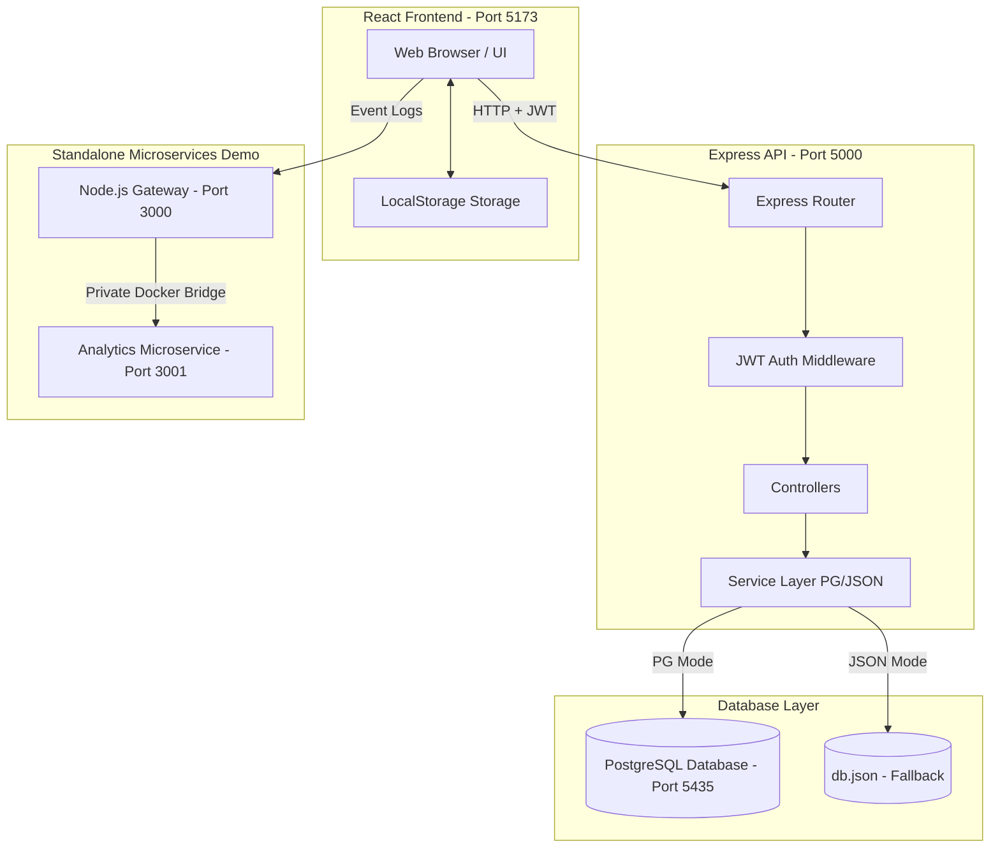

# E-Test System (Online Exam Management Application)

A modern Full-Stack web application designed for teachers to author and manage assessments, and for students to securely log in, take tests, get auto-graded scores, and receive manual grade overrides and written feedback from teachers.

The application is built using a decoupled architecture (React frontend + Node/Express backend) with a secure JWT-based authentication system and supports a flexible database strategy (PostgreSQL with Docker/Cloud connection, or a local JSON file-based database for offline mock mode).

---

## 🏗️ System Architecture



---

## 🗄️ Database Entity Relationship (ER) Diagram

```mermaid
erDiagram
    USERS {
        int id PK
        string username UNIQUE
        string password "Hashed / Plain fallback"
        string fullName
        string role "teacher | student"
    }
    EXAMS {
        int id PK
        string title
        string status "draft | published"
        int duration
        int extraTime
        string allowedMaterials
        string teacherAvailable
        jsonb questions
        int teacherId FK
    }
    STUDENT_SCORES {
        int id PK
        string studentName
        int studentId FK
        int examId FK
        string examTitle
        int score
        int totalQuestions
        int grade
        string date
        jsonb answers
        string feedback
        int manualGrade
    }

    USERS ||--o{ EXAMS : "creates"
    USERS ||--o{ STUDENT_SCORES : "submits"
    EXAMS ||--o{ STUDENT_SCORES : "receives"
```

---

## 🛠️ Technology Stack & Dependencies

### Frontend (`client/`)
* **Core:** React 19 + Vite
* **Styling:** Bootstrap 5 (for premium responsive design and layout grids)
* **Utilities:** Custom wrapper services (`ConfigService`, `StorageService`, `NotifyService`)

### Backend (`server/`)
* **Core:** Node.js + Express 5
* **Authentication:** `jsonwebtoken` (JWT stateless authorization)
* **Security:** `bcrypt` (Secure password hashing)
* **Database Driver:** `pg` (PostgreSQL client pool)
* **Environments:** `dotenv` for configuration injection

### Microservices (`microservices/`)
* **Gateway Service:** Node.js + Express on Port 3000 (serves as a entry routing gateway)
* **Analytics Service:** Node.js + Express on Port 3001 (stores and aggregates microservice logs)
* **Containers:** Configured via Docker Compose with private bridge networking.

---

## 🚀 Installation and Local Setup

### 1. Prerequisites
Make sure you have [Node.js](https://nodejs.org/) (v16+) and [Docker Desktop](https://www.docker.com/products/docker-desktop/) installed on your computer.

### 2. Database Set Up (Docker Compose)
To run the database locally for free using the pre-configured Docker container:
1. Open a terminal in the root folder and start the database:
   ```bash
   docker compose up -d postgres
   ```
   *This initializes a PostgreSQL database inside a container mapped to port `5435`.*

### 3. Server Configuration & Startup
1. Navigate to the server folder:
   ```bash
   cd server
   ```
2. Install dependencies:
   ```bash
   npm install
   ```
3. Create your `.env` configuration file by duplicating `.env.example`:
   ```bash
   copy .env.example .env
   ```
   *Make sure `DB_MODE` is set to `docker_pg` to use your local Docker container.*
4. Seed the database tables and data (passwords will be securely hashed with bcrypt):
   ```bash
   npm run seed
   ```
5. Start the backend application:
   ```bash
   npm run start
   ```
   *The server starts listening on [http://localhost:5000/api](http://localhost:5000/api).*

### 4. Client Configuration & Startup
1. Open a new terminal and navigate to the client folder:
   ```bash
   cd client
   ```
2. Install dependencies:
   ```bash
   npm install
   ```
3. Start the Vite development server:
   ```bash
   npm run dev
   ```
   *The client opens in your browser at [http://localhost:5173/](http://localhost:5173/).*

---

## 🔑 Seeding Demo Accounts
After running the seed script, the following demo logins are available:

| User | Username | Plain Password | Role |
|---|---|---|---|
| **Maya Cohen** | `teacher1` | `123444` | Teacher |
| **Rami Levi** | `teacher2` | `23417` | Teacher |
| **Noor Ahmed** | `student1` | `1789` | Student |
| **Lina Mansour** | `student2` | `258` | Student |
| **Adam Saleh** | `student3` | `12345` | Student |

---

## 🐋 Running Standalone Microservices Milestone
To test the standalone microservices gateway and analytics demo:
1. Navigate to the `microservices` directory:
   ```bash
   cd microservices
   ```
2. Spin up the gateway and logging containers:
   ```bash
   docker compose up -d --build
   ```
3. Access the Node.js Gateway at [http://localhost:3000/](http://localhost:3000/) in your browser. All inbound logs will automatically forward to the Analytics service in the background!