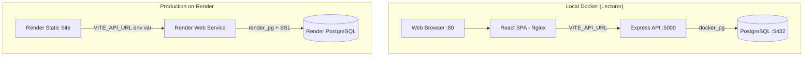
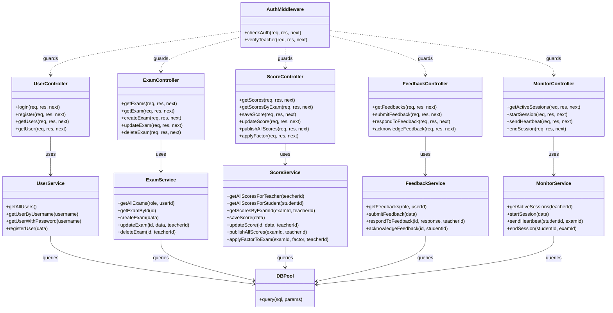
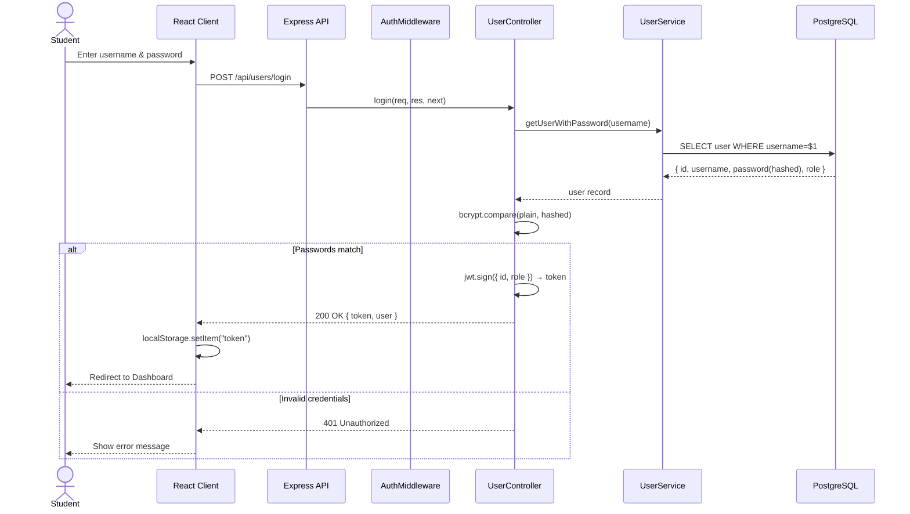
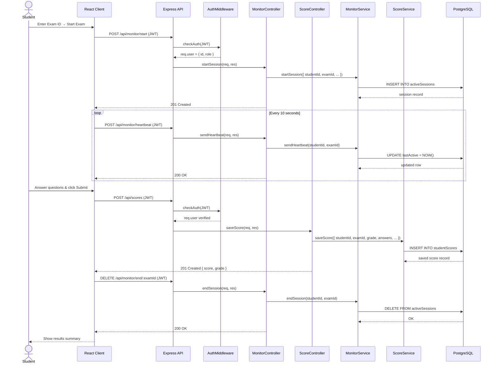
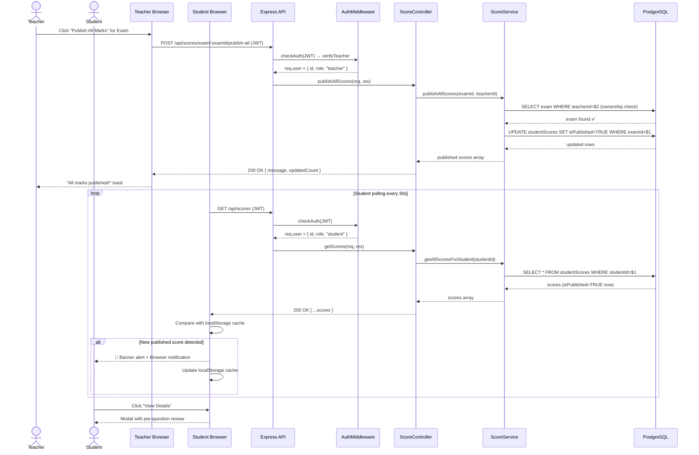
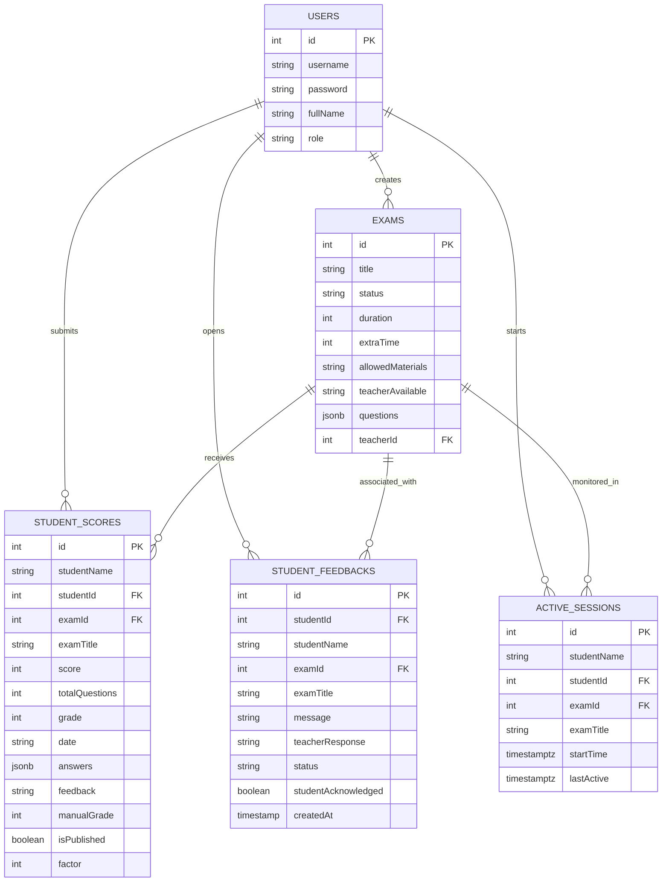

# E-Test System (Online Exam Management Application)

**GitHub Repository:** [https://github.com/shathashams/ExamApp](https://github.com/shathashams/ExamApp)  
**Live Demo:** [https://examapp-ww47.onrender.com](https://examapp-ww47.onrender.com)

A decoupled, production-ready Full-Stack web application designed for educational institutes. It enables teachers to author assessments, set custom question point weights, monitor active student test-taking sessions in real-time, apply factor curves, and publish grades. Students can securely take exams with live countdown clocks, receive instant alerts upon marks release, and query teachers with written feedback.

---

## ⚡ Quick Start — Run with Docker

> **Prerequisite:** [Docker Desktop](https://www.docker.com/products/docker-desktop/) must be installed and running.

```bash
git clone <repo-url>
cd ExamApp
docker compose up --build
```

Open **[http://localhost](http://localhost)** in your browser — the full app is ready. 🎉

| URL | Service |
|---|---|
| [http://localhost](http://localhost) | Frontend (React SPA) |
| [http://localhost:5000/api/status](http://localhost:5000/api/status) | API health check |
| `localhost:5435` | PostgreSQL (pgAdmin / DBeaver) |

Docker will automatically:
1. Pull and start **PostgreSQL 15**
2. Run the **seeder** — creates all tables and inserts demo accounts
3. Start the **Express API server** on port `5000`
4. Build and serve the **React frontend** via Nginx on port `80`

```bash
docker compose down          # stop containers (data preserved)
docker compose down -v       # stop + wipe all data (clean slate)
```

---

## 🔑 Demo Access Accounts

Available immediately after `docker compose up --build` (no manual steps needed):

| Full Name | Username | Password | Role |
|---|---|---|---|
| **Maya Cohen** | `teacher1` | `123444` | Teacher |
| **Rami Levi** | `teacher2` | `23417` | Teacher |
| **Noor Ahmed** | `student1` | `1789` | Student |
| **Lina Mansour** | `student2` | `258` | Student |
| **Adam Saleh** | `student3` | `12345` | Student |

---

## 🌟 Key Features

### 1. Security & Authentication
* **JWT Stateless Authorization:** Secure session tokens sent via HTTP `Authorization` headers.
* **Bcrypt Encryption:** Secure password hashing (10 salt rounds) on user registration.
* **Role-Based Guards:** Strictly isolates student views from teacher dashboards via backend routing middleware.

### 2. Teacher Dashboard & Exam Authoring
* **Dynamic Exam Creator:** Build exams with titles, descriptions, allowed materials, and duration.
* **Custom Question Points:** Define precise point values per question. The UI displays the *Total Points* to help teachers balance assessments to 100 points.
* **Bulk Release:** Release all submissions for a specific exam simultaneously with a single click ("Publish All Marks").
* **Grade Factor Curves:** Globally apply positive or negative grade offsets to all submissions of an exam (capped at 100%).
* **Live Exam Monitor:** Real-time monitoring of student connectivity status (`Online 🟢`, `Away 🟡`, `Disconnected 🔴`) via background ping tracking.

### 3. Student Portal & Testing Interface
* **Secure Entry:** Start assessments using a unique exam ID.
* **Live Countdown Timer:** Displays remaining work time. The timer turns yellow at 5 minutes and red at 1 minute, automatically submitting the exam when time reaches zero. Students can hide the timer to reduce stress.
* **Weighted Grading Fallback:** Automatically calculates scores using custom question points. Legacy exams default to equal point distribution.
* **Real-Time Marks Alerts:** Student dashboards poll for published results, instantly displaying a top-level banner and browser notification when the teacher releases grades, utilizing `localStorage` caching to prevent duplicate alerts.

---

## 🏗️ System Architecture



---

## 📡 Main API Endpoints

All endpoints are prefixed with `/api`. Protected routes require a `Bearer <JWT>` token in the `Authorization` header.

### Auth — `/api/users`
| Method | Endpoint | Auth | Role | Description |
|---|---|---|---|---|
| `POST` | `/api/users/login` | ❌ | Any | Login and receive a JWT token |
| `POST` | `/api/users/register` | ❌ | Any | Register a new student account |
| `GET` | `/api/users` | ✅ | Any | Get list of all users (no passwords) |
| `GET` | `/api/users/:username` | ✅ | Any | Get a specific user by username |

### Exams — `/api/exams`
| Method | Endpoint | Auth | Role | Description |
|---|---|---|---|---|
| `GET` | `/api/exams` | ✅ | Any | Get all exams (filtered by role) |
| `GET` | `/api/exams/:id` | ✅ | Any | Get a single exam by ID |
| `POST` | `/api/exams` | ✅ | Teacher | Create a new exam |
| `PUT` | `/api/exams/:id` | ✅ | Teacher | Update an existing exam |
| `DELETE` | `/api/exams/:id` | ✅ | Teacher | Delete an exam |

### Scores — `/api/scores`
| Method | Endpoint | Auth | Role | Description |
|---|---|---|---|---|
| `GET` | `/api/scores` | ✅ | Any | Get scores (teacher → all owned; student → own only) |
| `GET` | `/api/scores/exam/:examId` | ✅ | Teacher | Get all scores for a specific exam |
| `POST` | `/api/scores` | ✅ | Student | Submit a new exam score |
| `PUT` | `/api/scores/:id` | ✅ | Teacher | Update score with feedback / manual grade |
| `POST` | `/api/scores/exam/:examId/publish-all` | ✅ | Teacher | Publish all scores for an exam |
| `POST` | `/api/scores/exam/:examId/factor` | ✅ | Teacher | Apply a grade factor curve to an exam |

### Feedback — `/api/feedbacks`
| Method | Endpoint | Auth | Role | Description |
|---|---|---|---|---|
| `GET` | `/api/feedbacks` | ✅ | Any | Get feedbacks (role-filtered) |
| `POST` | `/api/feedbacks` | ✅ | Student | Submit a new feedback/query |
| `PUT` | `/api/feedbacks/:id/respond` | ✅ | Teacher | Respond to a student's feedback |
| `PUT` | `/api/feedbacks/:id/acknowledge` | ✅ | Student | Acknowledge the teacher's response |

### Monitor — `/api/monitor`
| Method | Endpoint | Auth | Role | Description |
|---|---|---|---|---|
| `GET` | `/api/monitor` | ✅ | Teacher | Get all active exam sessions |
| `POST` | `/api/monitor/start` | ✅ | Student | Start an exam session (register to monitor) |
| `POST` | `/api/monitor/heartbeat` | ✅ | Student | Send a heartbeat ping every 10 seconds |
| `DELETE` | `/api/monitor/end/:examId` | ✅ | Student | End and remove the active exam session |

### System
| Method | Endpoint | Auth | Description |
|---|---|---|---|
| `GET` | `/api/status` | ❌ | Health check — returns DB record counts |

---

## 🏛️ OOP UML Class Diagram



> **Relationships Key:**
> - `-->` *uses/depends on* — a controller delegates business logic to its service; a service calls the database pool.
> - `..>` *guards* — the `AuthMiddleware` validates the JWT and injects the user context before the request reaches any controller.
>
> **Business-Level Access Rules enforced by the Services:**
> - 🎓 **Teacher** can only view and manage **exams he created** (`WHERE teacherId = $1`).
> - 🎓 **Teacher** can only view scores, feedbacks, and monitor sessions that belong to **his own exams**.
> - 🎓 **Teacher** can publish marks or apply a grade factor **only for exams he owns** (ownership check before every write).
> - 📖 **Student** can only view **his own submitted scores** (`WHERE studentId = $1`) and cannot see other students' results.
> - 📖 **Student** can only see **published exams** (status = `published`) when browsing available exams.
> - 📖 **Student** can only submit **one score per exam** and can only manage his own active monitoring session.
> - 📖 **Student** can only view feedbacks **he submitted**, and teachers can only respond to feedbacks on **their own exams**.

---

## 🔁 Sequence Diagrams

### 1. Student Login & JWT Authentication



### 2. Student Takes Exam & Submits Score



### 3. Teacher Publishes Grades & Student Receives Alert



---

## 🗄️ Database Entity Relationship (ER) Diagram



---

## 🛠️ Technology Stack & Dependencies

### Frontend (`client/`)
* **React 19 & Vite 8:** Component rendering and fast production bundling.
* **Bootstrap 5:** Layout grid system, theme styling, and UI components.
* **Nginx:** Serves the production build inside Docker with SPA fallback routing.
* **Services:** Modular helpers (`ConfigService`, `StorageService`, `NotifyService`, `LoggerService`).

### Backend (`server/`)
* **Node.js & Express 5:** RESTful JSON API handling.
* **pg:** PostgreSQL connection pool.
* **bcrypt & jsonwebtoken:** Password hashing and stateless JWT authentication.
* **dotenv:** Environment variable loading.

### Infrastructure
* **Docker & Docker Compose:** Full local stack containerization (postgres, server, client).
* **PostgreSQL 15 Alpine:** Primary relational database with JSONB support.
* **Render.com:** Cloud hosting for production (Static Site + Web Service + PostgreSQL).

---

## 🖥️ Running Locally Without Docker (Manual)

If you prefer to run the server and client directly on your host machine:

### 1. Start the Database
```bash
docker compose up -d postgres
```

### 2. Start the Backend Server
```bash
cd server
npm install
# Copy the example env file and adjust if needed
copy .env.example .env      # Windows
cp .env.example .env        # macOS/Linux
npm run seed                # Create tables + insert demo data
npm run start
```

### 3. Start the Frontend Client
```bash
cd client
npm install
npm run dev
```
Open [http://localhost:5173/](http://localhost:5173/) in your browser.

---

## ☁️ Production Deployment (Render.com)

The project is deployed to Render with three services:

| Render Service | Type | Root Dir |
|---|---|---|
| `examapp-db` | PostgreSQL | — |
| `examapp-server` | Web Service | `server/` |
| `examapp-client` | Static Site | `client/` |

### Backend Environment Variables (Render Dashboard)
Set these in the Render Web Service → **Environment** tab:

| Variable | Value |
|---|---|
| `DB_MODE` | `render_pg` |
| `DATABASE_URL` | *(Internal DB URL from Render PostgreSQL dashboard)* |
| `JWT_SECRET` | *(A long random string — keep secret)* |
| `NODE_ENV` | `production` |

### Frontend Environment Variables (Render Dashboard)
Set in the Render Static Site → **Environment** tab (applied at build time):

| Variable | Value |
|---|---|
| `VITE_API_URL` | `https://your-server-name.onrender.com/api` |

### First Deploy — Seed the Database
After deploying the server, run the seed from local machine once:
```bash
# Set DATABASE_URL in server/.env to the Render External DB URL, then:
cd server
npm run seed
```

---

## 🐋 Database & Containerization Architecture

### 1. Database Choice: PostgreSQL 15
The system uses **PostgreSQL 15** as its primary persistent database engine.
* **Relational Safety:** Enforces strict Foreign Key relations between users, exams, submitted scores, active sessions, and student feedbacks.
* **JSONB Capabilities:** Utilizes unstructured JSONB columns for exam questions and student answers, combining SQL constraint safety with document-store flexibility.

### 2. Full-Stack Docker Compose
The entire local stack (database, server, client) runs inside Docker. The startup sequence is deterministic:

```
postgres  (healthy)
    ↓
seeder    (runs schema.sql → tables + demo data → exits 0)
    ↓
server    (Express API starts, connects to postgres)
    ↓
client    (Nginx serves the pre-built React SPA)
```

* **Seeder service:** Runs `schema.sql` on every fresh startup, dropping and recreating all tables with demo data. This guarantees demo accounts are always available.
* **Healthcheck:** Postgres uses `pg_isready` so dependent services never start against an unready database.
* **`.dockerignore`:** Excludes host `node_modules` (Windows binaries) so Docker installs Linux-native binaries inside the container.

### 3. Dynamic Environment Routing (`DB_MODE`)
The backend uses a polymorphic data-service layer controlled by `DB_MODE`:

| `DB_MODE` | Connection | SSL | Used by |
|---|---|---|---|
| `docker_pg` | `DATABASE_URL` (Docker internal) | ❌ | Local Docker stack |
| `render_pg` | `DATABASE_URL` (Render dashboard) | ✅ | Production on Render |
| `local_pg` | `DB_LOCAL_URL` | ❌ | Direct host PostgreSQL |
| `json` | `server/src/db/db.json` | ❌ | Offline demo / mock |

---

## 📖 Detailed Module Explanations

### 1. Security & Authentication (Login & Register)
* **Register:** Students can sign up with a unique username, full name, and password. The system applies a validation guard preventing students from registering as teachers.
* **Bcrypt Password Security:** Password inputs are encrypted using standard salt hashing (`bcrypt`) in the controller before database save transactions.
* **JWT Authentication:** Successful logins yield a signed stateless token containing the user context. This token is stored on the client via `localStorage` and sent with subsequent requests inside the HTTP `Authorization` header.
* **Role Guards:** Route-level middleware (`verifyToken`, `verifyTeacher`) validates headers, blocks student access to grading or monitoring endpoints, and returns standard HTTP `403 Forbidden` response statuses.

### 2. Teacher Dashboard
* **Exam Workspace:** Teachers see all exams they created, showing their IDs, titles, durations, and publish status.
* **Status Toggles:** Allows switching an exam status from `draft` (unseen by students) to `published` (visible on the student exam portal).
* **Feedback Notifications:** Displays notifications if a student leaves feedback or asks a question about an exam.

### 3. Create & Edit Exam
* **Exam Form Creator:** Configures metadata (exam title, duration in minutes, extra time, allowed materials, lecturer availability).
* **Inline Questions Builder:** Add, modify, or remove questions dynamically:
  - **Question Type Toggle:** Supports Multiple-Choice Questions (MCQ / Closed) or Open-Text Questions.
  - **Points Configuration:** Set custom weights for each question. The builder calculates the cumulative sum and displays a **Total Points** counter so teachers can balance the assessment weights.
  - **Answers Configuration:** Multiple choices are entered as comma-separated values. Correct answers (for closed questions) or reference answers/keywords (for open questions) are saved.
* **Inline Editing:** Teachers can update metadata or question properties directly, saving edits directly to the JSONB array structure.

### 4. Grade Factor Curve Engine
* **The Adjustment Tool:** Allows teachers to apply a positive or negative score offset (Factor) globally to all student submissions of a selected exam.
* **Mathematics:** The factor is applied dynamically on client display and backend services:
  $$\text{Final Grade} = \min(100, \text{Grade Percentage} + \text{Factor Value})$$
  *(The final grade is automatically capped at 100% to prevent values exceeding 100).*

### 5. Bulk Publish Marks
* **Release Flow:** When grading is complete, the teacher can click **"Publish All Marks"** for a specific exam.
* **Database Action:** Changes the database state of all associated score records from `"isPublished" = FALSE` to `TRUE`.
* **Real-time Alert Broadcast:** Instantly pushes notifications to online students, alerting them of their newly released scores.

### 6. Live Exam Monitoring
* **Student Heartbeats:** Active exam sessions send periodic background ping requests to `/api/monitor/heartbeat` every **10 seconds**.
* **Teacher Monitor Polling:** The teacher dashboard polls `/api/monitor` every **3 seconds** to retrieve active sessions.
* **Online & Offline Status Calculations:**
  - **Online 🟢:** Last heartbeat received within the last 20 seconds.
  - **Away / Disconnected 🟡:** No heartbeat received for > 20 seconds. This is typically triggered if the student closes their browser/tab without exiting the exam, loses internet connection, or if the browser puts the background exam tab to sleep.
  - *Note:* If the student finishes the exam or clicks **"Exit Exam"**, their session is formally closed and they are removed from the active monitoring list entirely.
* **Cross-Environment Clock Synchronization:**
  - Real-time systems often suffer from clock drifts between the database VM/Docker container and the host browser clock.
  - To prevent false "Away" statuses due to clock desynchronization, the `/api/monitor` API payload includes a `serverTime` timestamp representing the server's database-synchronized time. The client calculates status durations directly against `serverTime`, rendering connection statuses with 100% clock-drift immunity.
* **⚠️ Multi-Role Testing Guardrails:**
  - Since authorization tokens are stateless JWTs stored inside the browser's `localStorage`, testing the **Teacher Dashboard** and **Student Portal** simultaneously on the same browser profile will result in **token overwrites**.
  - **Correct Testing Workflow:** Use an **Incognito / Private Window** for the student and a standard window for the teacher, or use **two different browsers** (e.g., Chrome and Edge).

### 7. Performance Analytics & Score Graphs
* **Metrics Dashboard:** Calculates the **Class Average Grade**, standard deviation, total submissions, and score ranges.
* **Grade Distribution Graph:** Renders a clean line-graph/bar chart displaying the count of students inside different grade intervals (e.g. 0-54, 55-64, 65-74, 75-84, 85-100).
* **Data Source:** Pulls dynamically from the `studentScores` table, automatically updating as new submissions are graded.

### 8. Student Portal & Countdown Timer
* **Exam Entry:** Entering a valid Exam ID loads the exam details, rules, allowed materials, and duration.
* **Active Exam UI Lock (Navigation Guard):** When a student is actively taking an exam, the main navigation menu (Navbar) is completely hidden from the viewport. This isolates the testing interface, preventing students from accidentally clicking logout or navigating away from the assessment. The navbar automatically reappears once the exam is submitted or exited.
* **Stress-Free Countdown Timer:**
  - Converts duration to seconds and counts down in the background.
  - Changes colors dynamically to catch attention: **Blue** (>5 min), **Yellow** (1-5 min), **Red** (<1 min).
  - Features a **Hide/Show** button, allowing anxious students to hide the clock.
  - **Auto-Submit:** Triggers a callback that submits the student's selected answers immediately when the timer reaches `00:00`.

### 9. Student Results Review
* **Published Grades Inbox:** Students can view their final grade, date of submission, applied factor, and teacher's written remarks.
* **Detailed Answer Review:** Click "View Details" to open a modal that shows each question, the student's selected answer, the correct answer, and correct/incorrect status badges.
* **Feedback Queries:** Students can submit feedback or queries about their grades directly to the teacher from this view.

---

## 📁 Project Structure

```
ExamApp/
├── client/                    # React 19 + Vite frontend
│   ├── src/
│   │   ├── api/               # API service layer (examService, authService, etc.)
│   │   ├── components/        # Shared UI components (NavigationMenu, etc.)
│   │   ├── pages/             # Auth pages (Login, Register)
│   │   ├── teacherPages/      # Teacher dashboard, exam management
│   │   ├── studentPages/      # Student portal, results
│   │   └── utils/             # Services (ConfigService, StorageService, etc.)
│   ├── Dockerfile             # Multi-stage: Vite build → Nginx serve
│   └── .dockerignore
│
├── server/                    # Node.js + Express 5 backend
│   ├── src/
│   │   ├── db/
│   │   │   ├── connect.js     # DB pool factory (DB_MODE routing)
│   │   │   ├── schema.sql     # Tables + demo seed data
│   │   │   └── seed.js        # Runs schema.sql against the DB
│   │   ├── controllers/       # Route handlers
│   │   ├── routes/            # Express routers
│   │   ├── middleware/        # JWT auth, request logger, error handler
│   │   └── services/          # Business logic layer
│   ├── Dockerfile             # Node 20 Alpine, production deps only
│   ├── .dockerignore
│   ├── .env                   # Local env (gitignored)
│   └── .env.example           # Template with placeholders
│
├── microservices/             # Optional standalone demo (gateway + analytics)
│   └── docker-compose.yml
│
├── docker-compose.yml         # Full local stack: postgres + seeder + server + client
└── README.md
```

---

## 🐋 Optional Microservices Diagnostic Event Logger
To run the standalone microservices Gateway & Logging service demo:
1. Navigate to the `microservices` folder:
   ```bash
   cd microservices
   ```
2. Spin up the containers:
   ```bash
   docker compose up -d --build
   ```
3. Access the Gateway router at [http://localhost:3000/](http://localhost:3000/). Diagnostic event pings automatically forward to the Analytics container (port 3001) in the background.