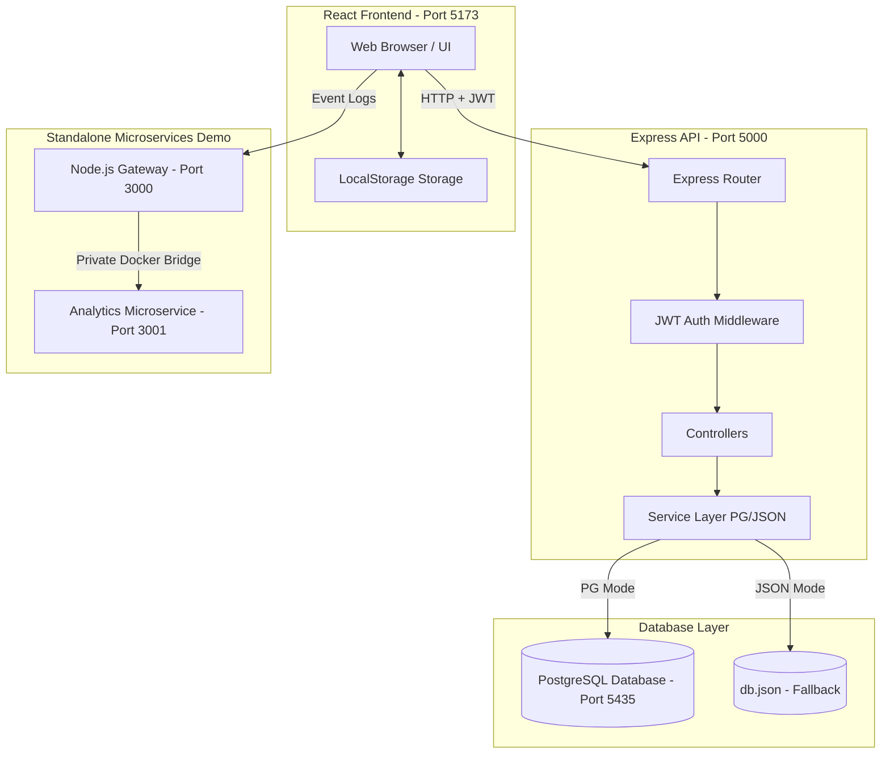

# E-Test System (Online Exam Management Application)

A decoupled, production-ready Full-Stack web application designed for educational institutes. It enables teachers to author assessments, set custom question point weights, monitor active student test-taking sessions in real-time, apply factor curves, and publish grades. Students can securely take exams with live countdown clocks, receive instant alerts upon marks release, and query teachers with written feedback.

---

## 🏗️ System Architecture



---

## 🌟 Key Features

### 1. Security & Authentication
* **JWT Stateless Authorization:** Secure session tokens sent via HTTP `Authorization` headers.
* **Bcrypt Encryption:** Secure password hashing (10 salt rounds) on user registration.
* **Role-Based Guards:** Strictly isolates student views from teacher dashboards via backend routing middleware.

### 2. Teacher Dashboard & Exam Authoring
* **Dynamic Exam Creator:** Build exams with titles, descriptions, allowed materials, and duration.
* **Custom Question Points:** Define precise point values per question. The UI displays the *Total Points* to help teachers balance assessments to 100 points.
* **Bulk Release:** Release all submissions for a specific exam simultaneously with a single click ("Publish All Marks").
* **Grade Factor Curves:** Globally apply positive or negative grade offsets to all submissions of an exam (capped at 100%).
* **Live Exam Monitor:** Real-time monitoring of student connectivity status (`Online 🟢`, `Away 🟡`, `Disconnected 🔴`) via background ping tracking.

### 3. Student Portal & Testing Interface
* **Secure Entry:** Start assessments using a unique exam ID.
* **Live Countdown Timer:** Displays remaining work time. The timer turns yellow at 5 minutes and red at 1 minute, automatically submitting the exam when time reaches zero. Students can hide the timer to reduce stress.
* **Weighted Grading Fallback:** Automatically calculates scores using custom question points. Legacy exams default to equal point distribution.
* **Real-Time Marks Alerts:** Student dashboards poll for published results, instantly displaying a top-level banner and browser notification when the teacher releases grades, utilizing `localStorage` caching to prevent duplicate alerts.

---

## 🗄️ Database Entity Relationship (ER) Diagram

```mermaid
erDiagram
    USERS {
        int id PK
        string username UNIQUE
        string password "Hashed / Plain fallback"
        string fullName
        string role "teacher | student"
    }
    EXAMS {
        int id PK
        string title
        string status "draft | published"
        int duration
        int extraTime
        string allowedMaterials
        string teacherAvailable
        jsonb questions "Includes individual question points"
        int teacherId FK
    }
    STUDENT_SCORES {
        int id PK
        string studentName
        int studentId FK
        int examId FK
        string examTitle
        int score
        int totalQuestions
        int grade "Calculated using question points"
        string date
        jsonb answers
        string feedback
        int manualGrade
        boolean isPublished
        int factor
    }
    STUDENT_FEEDBACKS {
        int id PK
        int studentId FK
        string studentName
        int examId FK
        string examTitle
        string message
        string teacherResponse
        string status "pending | responded"
        boolean studentAcknowledged
        timestamp createdAt
    }
    ACTIVE_SESSIONS {
        int id PK
        string studentName
        int studentId FK
        int examId FK
        string examTitle
        timestamp startTime
        timestamp lastActive "Updated via 10s client heartbeats"
    }

    USERS ||--o{ EXAMS : "creates"
    USERS ||--o{ STUDENT_SCORES : "submits"
    EXAMS ||--o{ STUDENT_SCORES : "receives"
    USERS ||--o{ STUDENT_FEEDBACKS : "opens"
    EXAMS ||--o{ STUDENT_FEEDBACKS : "associated_with"
    USERS ||--o{ ACTIVE_SESSIONS : "starts"
    EXAMS ||--o{ ACTIVE_SESSIONS : "monitored_in"
```

---

## 🛠️ Technology Stack & Dependencies

### Frontend (`client/`)
* **React 19 & Vite:** Render components and fast bundle serving.
* **Bootstrap 5:** Layout grid system, theme styling, and components.
* **Services:** Modular service helpers (`ConfigService`, `StorageService`, `NotifyService`).

### Backend (`server/`)
* **Node.js & Express 5:** RESTful JSON API handling.
* **pg:** PostgreSQL client pool routing.
* **bcrypt & jsonwebtoken:** Security, encryption, and token validation.

---

## 🚀 Installation & Local Startup

### 1. Start the Database (Docker)
Ensure Docker is running on your machine, then execute the following command at the root of the project to launch PostgreSQL on port `5435`:
```bash
docker compose up -d postgres
```

### 2. Start Backend Server (`server/`)
1. Navigate to the server directory:
   ```bash
   cd server
   ```
2. Install dependencies:
   ```bash
   npm install
   ```
3. Initialize the environment variables file:
   ```bash
   copy .env.example .env
   ```
   *Make sure `DB_MODE` is set to `docker_pg` to use the PostgreSQL container.*
4. Run the seed script to create tables and insert mock users/exams:
   ```bash
   npm run seed
   ```
5. Start the API application:
   ```bash
   npm run start
   ```

### 3. Start Frontend Client (`client/`)
1. Open a new terminal window and navigate to the client folder:
   ```bash
   cd client
   ```
2. Install dependencies:
   ```bash
   npm install
   ```
3. Start the development server:
   ```bash
   npm run dev
   ```
   *Open [http://localhost:5173/](http://localhost:5173/) to use the application.*

---

## 🔑 Demo Access Accounts

After running the seed script, log in using the credentials below:

| Name | Username | Password | Role |
|---|---|---|---|
| **Maya Cohen** | `teacher1` | `123444` | Teacher |
| **Rami Levi** | `teacher2` | `23417` | Teacher |
| **Noor Ahmed** | `student1` | `1789` | Student |
| **Lina Mansour** | `student2` | `258` | Student |
| **Adam Saleh** | `student3` | `12345` | Student |

---

## 🐋 Optional Microservices Diagnostic Event Logger
To run the standalone microservices Gateway & Logging service demo:
1. Navigate to the `microservices` folder:
   ```bash
   cd microservices
   ```
2. Spin up the containers:
   ```bash
   docker compose up -d --build
   ```
3. Access the Gateway router at [http://localhost:3000/](http://localhost:3000/). Diagnostic event pings automatically forward to the Analytics container (port 3001) in the background.