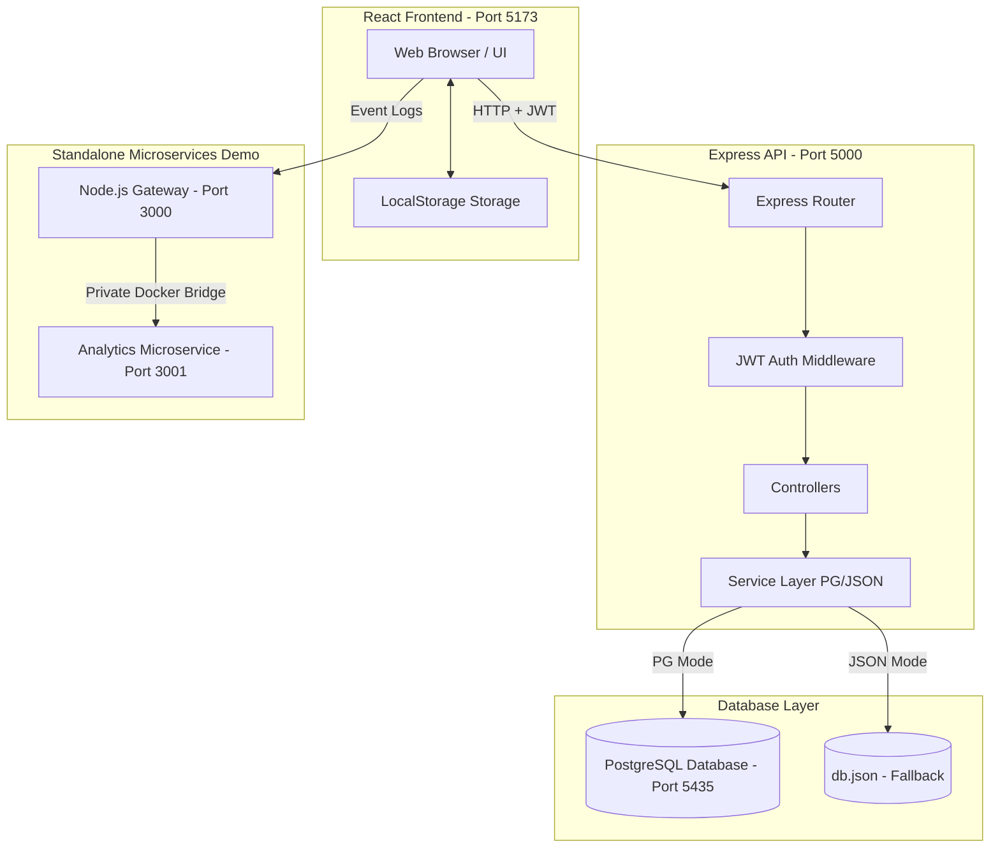
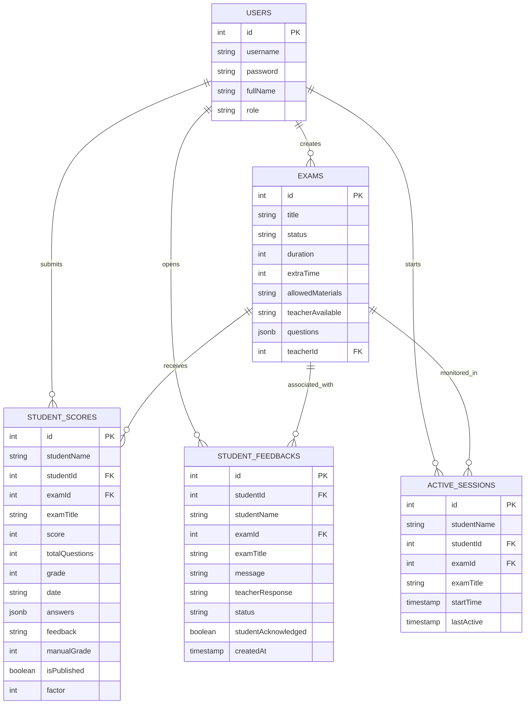

# E-Test System (Online Exam Management Application)

A decoupled, production-ready Full-Stack web application designed for educational institutes. It enables teachers to author assessments, set custom question point weights, monitor active student test-taking sessions in real-time, apply factor curves, and publish grades. Students can securely take exams with live countdown clocks, receive instant alerts upon marks release, and query teachers with written feedback.

---

## 🏗️ System Architecture



---

## 🌟 Key Features

### 1. Security & Authentication
* **JWT Stateless Authorization:** Secure session tokens sent via HTTP `Authorization` headers.
* **Bcrypt Encryption:** Secure password hashing (10 salt rounds) on user registration.
* **Role-Based Guards:** Strictly isolates student views from teacher dashboards via backend routing middleware.

### 2. Teacher Dashboard & Exam Authoring
* **Dynamic Exam Creator:** Build exams with titles, descriptions, allowed materials, and duration.
* **Custom Question Points:** Define precise point values per question. The UI displays the *Total Points* to help teachers balance assessments to 100 points.
* **Bulk Release:** Release all submissions for a specific exam simultaneously with a single click ("Publish All Marks").
* **Grade Factor Curves:** Globally apply positive or negative grade offsets to all submissions of an exam (capped at 100%).
* **Live Exam Monitor:** Real-time monitoring of student connectivity status (`Online 🟢`, `Away 🟡`, `Disconnected 🔴`) via background ping tracking.

### 3. Student Portal & Testing Interface
* **Secure Entry:** Start assessments using a unique exam ID.
* **Live Countdown Timer:** Displays remaining work time. The timer turns yellow at 5 minutes and red at 1 minute, automatically submitting the exam when time reaches zero. Students can hide the timer to reduce stress.
* **Weighted Grading Fallback:** Automatically calculates scores using custom question points. Legacy exams default to equal point distribution.
* **Real-Time Marks Alerts:** Student dashboards poll for published results, instantly displaying a top-level banner and browser notification when the teacher releases grades, utilizing `localStorage` caching to prevent duplicate alerts.

---

## 📖 Detailed Module Explanations

### 1. Security & Authentication (Login & Register)
* **Register:** Students can sign up with a unique username, full name, and password. The system applies a validation guard preventing students from registering as teachers.
* **Bcrypt Password Security:** Password inputs are encrypted using standard salt hashing (`bcrypt`) in the controller before database save transactions.
* **JWT Authentication:** Successful logins yield a signed stateless token containing the user context. This token is stored on the client via `localStorage` and sent with subsequent requests inside the HTTP `Authorization` header.
* **Role Guards:** Route-level middleware (`verifyToken`, `verifyTeacher`) validates headers, block student access to grading or monitoring endpoints, and returns standard HTTP `403 Forbidden` response statuses.

### 2. Teacher Dashboard
* **Exam Workspace:** Teachers see all exams they created, showing their IDs, titles, durations, and publish status.
* **Status Toggles:** Allows switching an exam status from `draft` (unseen by students) to `published` (visible on the student exam portal).
* **Feedback Notifications:** Displays notifications if a student leaves feedback or asks a question about an exam.

### 3. Create & Edit Exam
* **Exam Form Creator:** Configures metadata (exam title, duration in minutes, extra time, allowed materials, lecturer availability).
* **Inline Questions Builder:** Add, modify, or remove questions dynamically:
  - **Question Type Toggle:** Supports Multiple-Choice Questions (MCQ / Closed) or Open-Text Questions.
  - **Points Configuration:** Set custom weights for each question. The builder calculates the cumulative sum and displays a **Total Points** counter so teachers can balance the assessment weights.
  - **Answers Configuration:** Multiple choices are entered as comma-separated values. Correct answers (for closed questions) or reference answers/keywords (for open questions) are saved.
* **Inline Editing:** Teachers can update metadata or question properties directly, saving edits directly to the JSONB array structure.

### 4. Grade Factor Curve Engine
* **The Adjustment Tool:** Allows teachers to apply a positive or negative score offset (Factor) globally to all student submissions of a selected exam.
* **Mathematics:** The factor is applied dynamically on client display and backend services:
  $$\text{Final Grade} = \min(100, \text{Grade Percentage} + \text{Factor Value})$$
  *(The final grade is automatically capped at 100% to prevent values exceeding 100).*

### 5. Bulk Publish Marks
* **Release Flow:** When grading is complete, the teacher can click **"Publish All Marks"** for a specific exam.
* **Database Action:** Changes the database state of all associated score records from `"isPublished" = FALSE` to `TRUE`.
* **Real-time Alert Broadcast:** Instantly pushes notifications to online students, alerting them of their newly released scores.

### 6. Live Exam Monitoring
* **Student Heartbeats:** Active exam sessions send periodic ping requests to `/api/monitor/heartbeat` every **10 seconds**.
* **Teacher Monitor Polling:** The teacher dashboard polls `/api/monitor` every **3 seconds** to retrieve the list of active sessions for their exams.
* **Offline Detection:** Computes student activity times:
  - If a student's `lastActive` timestamp is within the last 15 seconds, status is `Online 🟢`.
  - If between 15 and 25 seconds, status switches to `Away 🟡`.
  - If older than 25 seconds (e.g. tab closed or network drop), status is `Disconnected 🔴`.

### 7. Performance Analytics & Score Graphs
* **Metrics Dashboard:** Calculates the **Class Average Grade**, standard deviation, total submissions, and score ranges.
* **Grade Distribution Graph:** Renders a clean line-graph/bar chart displaying the count of students inside different grade intervals (e.g. 0-54, 55-64, 65-74, 75-84, 85-100).
* **Data Source:** Pulls dynamically from the `studentScores` table, automatically updating as new submissions are graded.

### 8. Student Portal & Countdown Timer
* **Exam Entry:** Entering a valid Exam ID loads the exam details, rules, allowed materials, and duration.
* **Stress-Free Countdown Timer:**
  - Converts duration to seconds and counts down in the background.
  - Changes colors dynamically to catch attention: **Blue** (>5 min), **Yellow** (1-5 min), **Red** (<1 min).
  - Features a **Hide/Show** button, allowing anxious students to hide the clock.
  - **Auto-Submit:** Triggers a callback that submits the student's selected answers immediately when the timer reaches `00:00`.

### 9. Student Results Review
* **Published Grades Inbox:** Students can view their final grade, date of submission, applied factor, and teacher's written remarks.
* **Detailed Answer Review:** Click "View Details" to open a modal that shows each question, the student's selected answer, the correct answer, and correct/incorrect status badges.
* **Feedback Queries:** Students can submit feedback or queries about their grades directly to the teacher from this view.

---

## 🗄️ Database Entity Relationship (ER) Diagram



---

## 🐋 Database & Containerization Architecture

### 1. Database Choice: PostgreSQL 15
The system uses **PostgreSQL 15** as its primary persistent database engine. 
* **Relational Safety:** Enforces strict Foreign Key relations between users, exams, submitted scores, active sessions, and student feedbacks.
* **JSONB Capabilities:** Utilizes unstructured JSONB columns for the questions of an exam and responses of a student. This provides a hybrid layout, combining the security of SQL constraints with the schema flexibility of a document-oriented database.

### 2. Containerization (Docker Compose)
To simplify setup and avoid manual installations, the database is fully containerized inside a Docker container using **Docker Compose**:
* **Image:** Uses `postgres:15-alpine` (a highly lightweight, secure Alpine Linux build).
* **Port Mapping:** Maps local port `5435` to the internal PostgreSQL port `5432` inside the container. This prevents port conflicts with any pre-existing PostgreSQL installations on your computer.
* **Data Persistence:** Mounts a named Docker volume (`postgres_data:/var/lib/postgresql/data`) to prevent data loss. All registered accounts, exams, and grades are preserved when the container is stopped or restarted.
* **Auto-Initialization Schema:** Automatically runs `schema.sql` on the first launch of the container. It does this by mounting the initialization script:
  `./server/src/db/schema.sql ➔ /docker-entrypoint-initdb.d/init.sql:ro`

### 3. Dynamic Environment Routing (`DB_MODE`)
The backend is designed with a polymorphic data-service layer. It inspects the `DB_MODE` parameter inside `server/.env` to route data operations dynamically:
1. **`DB_MODE=json` (Mock Database):** The server redirects operations to read/write from the local JSON file (`server/src/db/db.json`). Useful for offline testing and offline demonstrations.
2. **`DB_MODE=docker_pg` (Local Container):** Connects to the local PostgreSQL database hosted in the Docker container on port `5435`.
3. **`DB_MODE=pg` (Cloud Environment):** Connects to a remote, cloud-hosted PostgreSQL instance (such as Render.com). It automatically detects cloud deployments and forces SSL connectivity:
   ```javascript
   ssl: process.env.DATABASE_URL ? { rejectUnauthorized: false } : false
   ```

---

## 🛠️ Technology Stack & Dependencies

### Frontend (`client/`)
* **React 19 & Vite:** Render components and fast bundle serving.
* **Bootstrap 5:** Layout grid system, theme styling, and components.
* **Services:** Modular service helpers (`ConfigService`, `StorageService`, `NotifyService`).

### Backend (`server/`)
* **Node.js & Express 5:** RESTful JSON API handling.
* **pg:** PostgreSQL client pool routing.
* **bcrypt & jsonwebtoken:** Security, encryption, and token validation.

---

## 🚀 Installation & Local Startup

### 1. Start the Database (Docker)
Ensure Docker is running on your machine, then execute the following command at the root of the project to launch PostgreSQL on port `5435`:
```bash
docker compose up -d postgres
```

### 1.1 Inspecting the Database (pgAdmin / DBeaver)
You can inspect or query the running database using **pgAdmin**, **DBeaver**, or any other database manager with the following connection details:
* **Host:** `localhost`
* **Port:** `5435` *(internal container port `5432` maps to `5435` on host)*
* **Maintenance Database:** `exam_app`
* **Username:** `postgres`
* **Password:** `postgres`

### 2. Start Backend Server (`server/`)
1. Navigate to the server directory:
   ```bash
   cd server
   ```
2. Install dependencies:
   ```bash
   npm install
   ```
3. Initialize the environment variables file:
   ```bash
   copy .env.example .env
   ```
   *Make sure `DB_MODE` is set to `docker_pg` to use the PostgreSQL container.*
4. Run the seed script to create tables and insert mock users/exams:
   ```bash
   npm run seed
   ```
5. Start the API application:
   ```bash
   npm run start
   ```

### 3. Start Frontend Client (`client/`)
1. Open a new terminal window and navigate to the client folder:
   ```bash
   cd client
   ```
2. Install dependencies:
   ```bash
   npm install
   ```
3. Start the development server:
   ```bash
   npm run dev
   ```
   *Open [http://localhost:5173/](http://localhost:5173/) to use the application.*

---

## 🔑 Demo Access Accounts

After running the seed script, log in using the credentials below:

| Name | Username | Password | Role |
|---|---|---|---|
| **Maya Cohen** | `teacher1` | `123444` | Teacher |
| **Rami Levi** | `teacher2` | `23417` | Teacher |
| **Noor Ahmed** | `student1` | `1789` | Student |
| **Lina Mansour** | `student2` | `258` | Student |
| **Adam Saleh** | `student3` | `12345` | Student |

---

## 🐋 Optional Microservices Diagnostic Event Logger
To run the standalone microservices Gateway & Logging service demo:
1. Navigate to the `microservices` folder:
   ```bash
   cd microservices
   ```
2. Spin up the containers:
   ```bash
   docker compose up -d --build
   ```
3. Access the Gateway router at [http://localhost:3000/](http://localhost:3000/). Diagnostic event pings automatically forward to the Analytics container (port 3001) in the background.